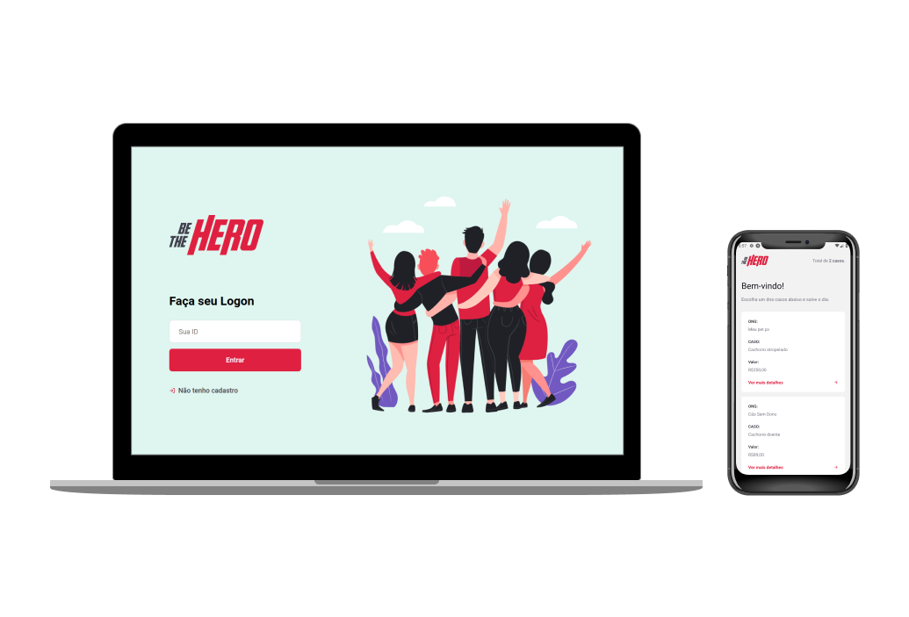

 

# Be The Hero

#### Aplicação para conectar ongs que precisam de ajuda e usuários dispostos a ajudar

## Tecnologias Utilizadas

### Backend

- Nodejs, Express, Knex, Jest, Sqlite

### Frontend

- ReactJS, Axios

### Mobile

- React Native, Expo, Axios
